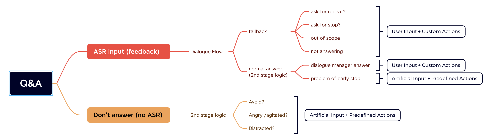

# Dialogue Manager (mainloop)

- [Dialogue Manager (mainloop)](#dialogue-manager-mainloop)
  - [Module Specifications](#module-specifications)
    - [Chatbot Dialogue Manager (CDM)](#chatbot-dialogue-manager-cdm)
      - [Communication Protocals](#communication-protocals)
      - [magic start](#magic-start)
        - [Data Formats](#data-formats)
      - [Interaction Details](#interaction-details)
    - [Grace APIs](#grace-apis)
      - [Communication Protocals](#communication-protocals-1)


This is the repo for Grace's Dialogue manager, basically consists of one `mainloop` and `three modules`:
1. A chatbot implemented with `DialogueFlow`. It is basically a dialogue manager from a chatbot. This part is contributed by Yejin and Willy. (Similar as `Rasa` architecture, as far as dingdong knows) This module can output a piece of text (utterance to a user) together with some parameters.
2. A multimodel `Engagement Estimator` that takes a user's voice and video input, and outputs an engagement level. It decides whether to continue or stop the conversation (or use any other strategies). This part is mainly contributed by dingdong.
3. A set of hardware interface `APIs`. The interface takes a json object as input, and generate actions by the Grace. The json object includes a text utterance annotated by emotions and gestures. The json object is contructed based on a database, currently the `*.csv` file under the data folder.

## Module Specifications

### Chatbot Dialogue Manager (CDM)

This part is contributed by Yejin and Willy. Basically in the `mainloop`, we need to input a sentence into the chatbot dialogue manager, and receive the output from the chatbot dialogue manager. The protocals needs to be specified.

#### Communication Protocals

#### magic start
```text
This is a magic phrase to initialize grace agent to welcome intent.
```


```
random input to repeat
```

##### Data Formats

* From CDM to ML
  * Json object with specification
  * HTTP protocal?
* From ML to CDM
  * Text input

#### Interaction Details



### Grace APIs

This is how the mainloop communicate with the Grace Robot.

#### Communication Protocals

* From APIs to mainloop
  * ASR
    * A complete sentence send when ready
    * An stream of words listened annotated by situations (i.e., some interruption from the users)
  * Visual
    * A stream of `emotions`
    * A stream of `gaze` area
    * A stream of `RGB sensor data`